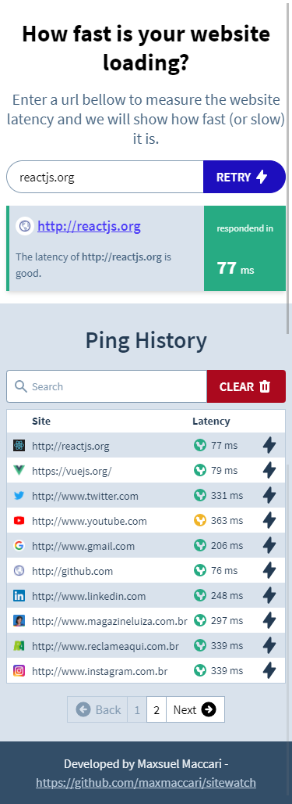
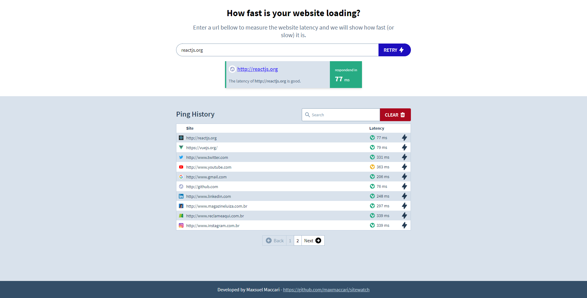

# Sitewatch


This is a demo project that you can use for 'ping' a website and get the time that the page loads in milliseconds.

It has the [sitewatch-api](https://github.com/maxmaccari/sitewatch-api) as the backend, that pings the websites from the server and returns to the frontend its results.

You can check this project running on [https://sitewatch.maxmaccari.vercel.app/](https://sitewatch.maxmaccari.vercel.app/).

## Screenshots





## Project setup

```
yarn install
```

### Compiles and hot-reloads for development

```
yarn serve
```

### Compiles and minifies for production

```
yarn build
```

### Run your unit tests

```
yarn test:unit
```

### Run your end-to-end tests

```
yarn test:e2e
```

### Lints and fixes files

```
yarn lint
```

### Or you can run all tests at once

```
yarn test
```

## Features
  * Ping a website and display its results in milliseconds;
  * Ping a website and display an error if there is an error;
  * Have a history of pingged websites;
  * The history is persisted in the local storage;
  * Clear the website history;
  * Ping a website again from the history;
  * Synchronize the ping history between tabs from same browser;
  * Search pingged websites by its url;
  * Display the favicon of each pingged website;
  * Paginate the ping history.

## What I've used?
  * VueJS 2.6
  * Vuex 3.4 for state management
  * vuex-persistedstate for state persisting on local storage
  * Axios for API calls performing
  * tailwindcss for the UI
  * eslint + prettier to enforce code quality
  * jest for unit tests
  * cypress for e2e tests

There's another version that uses `scss` and you can checkout it through `git checkout scss-version`.